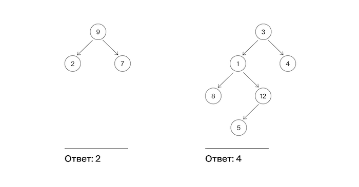

# Максимальная глубина

Алла хочет побывать на разных островах архипелага Алгосы. Она составила карту. Карта представлена в виде дерева: 
корень обозначает центр архипелага, узлы –— другие острова. А листья —– это дальние острова, на которые Алла хочет 
попасть.

Помогите Алле определить максимальное число островов, через которые ей нужно пройти для совершения одной поездки от 
стартового острова до места назначения, включая начальный и конечный пункты.

## Формат ввода

На вход функции подается корень бинарного дерева.

### Замечания про отправку решений

По умолчанию выбран компилятор make. Решение нужно отправлять в виде файла с расширением, которое соответствует вашему
языку программирования.