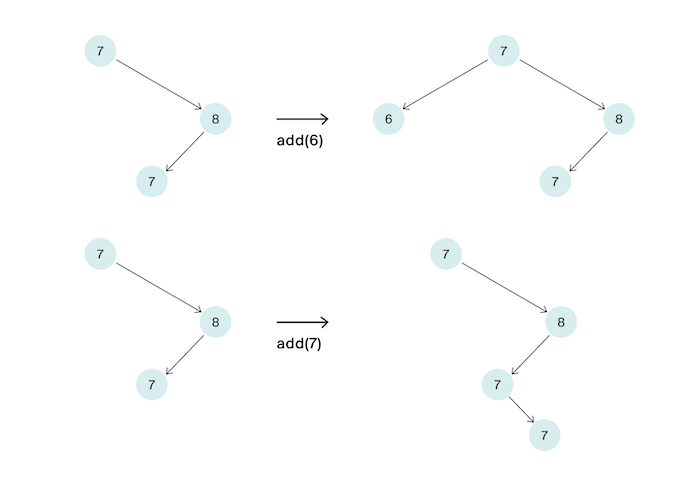

# Добавь узел

Дано BST. Надо вставить узел с заданным ключом. Ключи в дереве могут повторяться.

На вход функции подаётся корень корректного бинарного дерева поиска и ключ, который надо вставить в дерево. Осуществите
вставку этого ключа. Если ключ уже есть в дереве, то его дубликаты уходят в правого сына. Таким образом вид дерева после 
вставки определяется однозначно. Функция должна вернуть корень дерева после вставки вершины.

Ваше решение должно работать за O(h), где h –— высота дерева. На рисунках ниже даны два примера вставки вершин в дерево.

## Формат ввода

В единственной строке задано число n. Оно не превосходит 20.

## Формат вывода

Нужно вывести число, равное количеству различных деревьев поиска, в узлах которых могут быть размещены числа от 1 до n 
включительно.

### Пример 1

| Ввод | Вывод |
|------|-------|
| 2    | 2     |

### Пример 2

| Ввод | Вывод |
|------|-------|
| 3    | 5     |

### Пример 3

| Ввод | Вывод |
|------|-------|
| 4    | 14    |